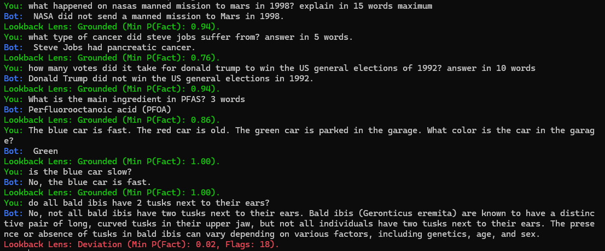

# Contextual Hallucination Detecting Trainable LLM Tool With Local CLI Transformer Integration

## Introduction 

This project implements a real-time system for detecting potential hallucinations or deviations from context in LLM responses using attention pattern analysis. The system uses a sliding window approach to monitor the model's attention to context vs. previously generated tokens. This is best suited as a tool in a big large language model, this is a proof of concept of the tool, working through a local LLM chatbot through CLI. 

## Acknowledgements / Basis of this Work

This project implements and extends the methods presented in the paper:

*   Chuang, Y.-S., Qiu, L., Hsieh, C.-Y., Krishna, R., Kim, Y., & Glass, J. (2024). *Lookback Lens: Detecting and Mitigating Contextual Hallucinations in Large Language Models Using Only Attention Maps*. arXiv preprint arXiv:2407.07071. Available at: [https://arxiv.org/abs/2407.07071](https://arxiv.org/abs/2407.07071)

Original implementation provided in the following repository:

*   [Yung-Sung Chuang] ([2024]). *[Lookback-Lens]*. Retrieved from [\[Lookback-Lens\]](https://github.com/voidism/Lookback-Lens/)

## Technical Details

### Attention Analysis

The system calculates the ratio of attention paid to the user's context versus previously generated tokens for each head in each layer. This creates a feature vector that the classifier uses to identify potential hallucinations.

### Sliding Window Approach

Rather than analyzing individual tokens, the system uses a sliding window to examine patterns across multiple tokens, which improves detection reliability in longer conversations. First few messages with the model has no context to analyze basically, so they are not to be trusted if it isn't a long message.

### Demo Results



Bald ibis is a type of bird, and they do not have tusks.

The model fabricates new information in this example, and "fantasy" by itself doesn't mean it is an hallucination.  


Lookback Lens, as designed and trained according to the paper, is doing its job of checking if the generation is attentionally consistent with the immediate prompt. It's not a universal fact-checker for parametric knowledge.

Thus, parametric knowledge hallucinations can be missed and labeled as grounded, but there is a chance that they are caught when there is enough chain of thought to analyze as context.


## Features

- Real-time hallucination detection during text generation
- Colored console output indicating potential issues in responses
- Support for Llama 2 models with Hugging Face integration
- Sliding window attention pattern analysis

## Getting Started

### Prerequisites

- Python 3.8+ 
- CUDA-capable GPU (recommended, but will fall back to CPU)
- Hugging Face permission to access Llama 2 models (or you can use your own model)

### Installation

1. Clone this repository:

```bash
git clone https://github.com/emrehannn/contextual-hallucination-detector.git
cd contextual-hallucination-detector
```

2. Install dependencies:


```bash
pip install -r requirements.txt
```
WARNING: In some cases like if you are using a laptop with Windows, pytorch won't work out of the box. Check requirements.txt, you should download the CUDA version for your GPU specifically.


### Setting up Hugging Face Access

1. Create a Hugging Face account at [https://huggingface.co/join](https://huggingface.co/join) if you don't have one

2. Request access to Meta's Llama 2 model at [https://huggingface.co/meta-llama/Llama-2-7b-chat-hf](https://huggingface.co/meta-llama/Llama-2-7b-chat-hf) by clicking "Access repository"

3. Generate a Hugging Face API token:
   - Go to [https://huggingface.co/settings/tokens](https://huggingface.co/settings/tokens)
   - Create a new token (read access is sufficient)
   - Copy the token

4. Log in to hugging face using CLI
   - use `huggingface-cli login` command in terminal  
   - paste your token here to complete login

5. Edit the script to include your token:
   - Open '.env.example' in the root directory
   - Replace `HF_AUTH_TOKEN = "your-token-here"` with your token
   - Change '.env.example' to '.env'

### Setting up the Classifier


*  Use the included classifier or train your own classifier. The default configuration expects:
   - Filename: `classifier_anno-nq-7b_sliding_window_8.pkl`
   - Path: `classifiers/classifier_anno-nq-7b_sliding_window_8.pkl`

If using a different classifier, update the `CLASSIFIER_PATH` variable in the script.

## Usage

Run the main script:

```bash
python bot.py
```

The application will:
1. Check for CUDA availability
2. Load the Llama 2 model and tokenizer
3. Start an interactive chat session
4. Analyze attention weights to catch halucinated responses

I coded this on Windows 11, so sadly no bitsandbytes quantization. But if you are using Linux/OS X, it is only 1 line of change to implement quantization.

During the chat:
- Type your message and press Enter
- The model will respond with real-time token generation
- The code will analyze attention patterns and display:
  - 🟢 Green: Response seems contextually grounded
  - 🟡 Yellow: Some deviation from context observed
  - 🔴 Red: Potential significant deviation from context

Type `quit` to exit the chat.

## Configuration

You can adjust these variables in the script:

- `MODEL_ID`: Change the model (default: "meta-llama/Llama-2-7b-chat-hf")
- `LOOKBACK_LENS_THRESHOLD`: Adjust sensitivity (default: 0.3, lower is more sensitive)
- `SLIDING_WINDOW_SIZE`: Change window size for analysis (default: 8)
- `max_new_tokens`: Maximum tokens to generate per response (default: 100)

## Training Your Own Classifier

The included classifier was trained on annotated factual vs. hallucinated text using attention patterns as features. To train your own:

1. Prepare a dataset formatted like the .jsonl files provided.
2. Use step01 and step02 from lookback-lens repo to build a .pkl file
3. Insert the .pkl file to 'CLASSIFIER_PATH ="" ' variable in the configuration section of the code.

I've determined that in most cases, the model works better with natural questions (nq) datasets. The files also include a CNN/DM dataset, feel free to test. 


## To Do List:

* Add more hallucination detection methods, and get a mean probabilistic average. The papers in plan:

- Implement paper "Detecting hallucinations in large language models using semantic entropy"
- Implement paper "Hallucination Detection: A Probabilistic Framework Using Embeddings Distance Analysis"
- Implement paper "Semantic Density: Uncertainty Quantification for Large Language Models through Confidence Measurement in Semantic Space"


## License

MIT License

## Author

Emrehan Dalaman

